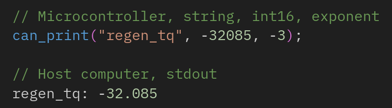

# can print



`can print` is a tool for print-based debugging over CAN. All static inputs of a
`can_print` message are processed at _compile time_ using C function-like
macros. Accordingly, an initial configuration of `can_print` with a single print
message adds approximately 400B to an image, and each additional instance of a
message adds 20B. `can_print` messages are set as the lowest priority of
standard 11-bit arbitration IDs via the `0x7FF` ID.

See **Quick Start** to add `can_print` to your project, **Flash and Print
Integration** for running the `can print` decoder after flashing, **Reference**
for using the main `can_print` macro, **Examples** for examples, and **Errata**
for known undefined behavior.

## Quick Start

First, add the `can print` header to a source file and use the `can print`
macro.

```
// example_file.c
#include "projects/can_print/can_print.h"

// Example usage
can_print("regen_tq", -32085, 3);
```

Next, add `can print` as a dependency to the `cc_firmware` rule in your `BUILD`
file.

```
# BUILD
cc_firmware(
    name = "can_print_example",
    srcs = [
        "can_print_example.c",
    ],
    target_compatible_with = select({
        "//bazel/constraints:atmega16m1": [],
        "//conditions:default": ["//bazel/constraints:incompatible_mcu"],
    }),
    deps = [
        ":can_api",
        "//libs/timer",
        "//projects/can_print,
    ],
)
```

Then, start a socketcan connection and the `can_print` decoder. Note that the
decoder is blocking - run it in a new terminal.

```
sudo ip link set can0 up type can bitrate 500000
bazel run //projects/can_print:can_print_decode
```

Finally, flash the target. `can print` output will display as soon as the target
is flashed. The decoder can be kept open between consecutive flashes.

```
bazel run --config=16m1 -c opt //examples/can_print:can_print_example -- -c usbasp
```

### Flash and Print Integration

Through Bazel integrations, `can print` also supports flashing and printing in a
single Bazel command. However, objectively it does not use Bazel properly. Use
at your own risk.

First, add the following parameters to the `cc_firmware` rule in the target
BUILD file.

```
can_print_bitrate = "500000",
can_print_bus = "can0",
can_print_flash_isp = "usbasp",
```

Full `cc_firmware` definition:

```
# BUILD
cc_firmware(
    name = "can_print_example",
    srcs = [
        "can_print_example.c",
    ],
    can_print_bitrate = "500000",
    can_print_bus = "can0",
    can_print_flash_isp = "usbasp",
    target_compatible_with = select({
        "//bazel/constraints:atmega16m1": [],
        "//conditions:default": ["//bazel/constraints:incompatible_mcu"],
    }),
    deps = [
        ":can_api",
        "//libs/timer",
        "//projects/can_print",
    ],
)
```

Then, start a socketcan connection and run the following command:

```
bazel run --config=16m1 -c opt //examples/can_print:can_print
```

For any valid `cc_firmware` instance in a `BUILD` file, the `can_print` target
is available. This target will build an image, flash, and start the decoder in a
single Bazel command.

## Reference

Main `can_print` macro reference.

`can_print(string, value, multiplier);`

`string`: (char[8]) The string to print. \
`value`: (int16) Optional, the value to print.  
`multiplier`: (int4) Optional, the power of ten to multiply the value by.

## Examples

The following examples are available in
`//examples/can_print/can_print_example.c`

Example 1: Printing text only

```
can_print("oem");
stdout: oem
```

Example 2: Printing text and a number

```
can_print("oem_num", 240);
stdout: oem_num: 240
```

Example 3: Printing text and a negative number

```
can_print("negative", -12345);
stdout: negative: -12345
```

Example 4: Printing text, a number, and a multiplier

```
can_print("oem_num", 24, 1);
stdout: oem: 240
```

Example 5: Printing text, a number, and a negative multiplier

```
can_print("pi", 31415, -4);
stdout: pi: 3.1415
```

Example 6: Printing text, a negative number, and a negative multiplier

```
can_print("regen_tq", -32085, -3);
stdout: regen_tq: -32.085
```

Example 7: Math in value field, rounded to an int

```
can_print("math", ((3340 + 189) / 2) * 0.25);
stdout: math: 441
```

Example 8: Dynamic values

```
uint16_t counter = 0;
  while (counter < 10) {
      can_print("dynamic",
                counter);
      counter++;
  }

stdout:
dynamic: 0
dynamic: 1 ... dynamic: 9
```

Example 9: Dynamic negative values

```
while (counter > 0) {
    can_print("_dynamic",
              -1 * counter);
    counter--;
}

stdout:
_dynamic: -10
_dynamic: -9 ... _dynamic: -1
```

The next few examples demonstrate unintended uses of `can print`.

Example 10: Character overflow; truncated to 8 characters.

```
can_print("olinelectricmotorsports");
stdout: olinelec
```

Example 11: Value integer overflow; compiler warning

```
can_print("overflow", INT16_MAX + 1);
```

Example 12: Multiplier integer overflow; undefined behavior

```
can_print("multi_ov", 1, 9);
stdout: multi_ov: 1e-07
```

## Errata

Because `value` and `multiplier` can be dynamic values - those unknown at
compile time, there is the risk of integer overflow or underflow. Adding bounds
checking to these values is possible, but would add additional overhead to every
`can print` call. As such, bounds checking is left to the user. The following
known undefined behavior exists:

- Integer overflow and underflow of `value` fails to compile with a static
  value, but prints a unknown value with dynamic values.
- Integer overflow and underflow of `multiplier` compiles, but prints an unknown
  value.

### Future Extentions

The following are future exentions that could either enhance `can print` or
replace it entirely.

- Optional timestamps for can print messages in stdout. Ex: "[2024-09-30
  04:11:13] regen_tq: -32.085"
- Support for floating point and values larger than an `int16`.
- Larger `can_print` messages that stream over multiple CAN messages, adjusting
  to the character and value inputs.
- A wrapper around the `uart` library or modifications to the `uart` library for
  printing over `uart`. This would require the `uart` pins on microcontrollers
  are both reserved and exposed via headers.

## Addendum: can print Bit Packing

A single `can print` message is packed into a standard CAN message of 8 bytes.
The following is pulled directly from `can_print.h`.

```
// can_print.h
/**
- Bit packing for a can print message.
-
-       lsb                                                           msb
- field: |c_0|c_1| c_2 | c_3 | c_4 | c_5 | c_6 | c_7 |value|multi|resv |
- bits: |0-4|5-9|10-14|15-19|20-24|25-29|30-34|35-39|40-55|56-59|60-63|
-
- c_x: An [a-z] character to print.
- int16: A int16 value to print.
- multi: The multiplier to apply to the value.
- resv: Reserved bits. Do not access.
*/
```
